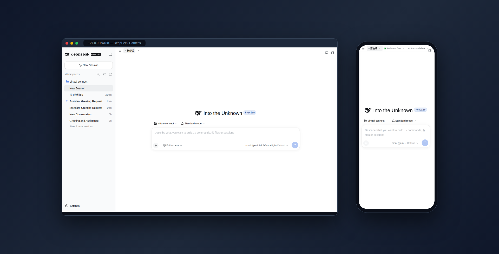

# dsh-qol

<p align="center">
  <a href="./README.md"><strong>简体中文</strong></a> ·
  <a href="./README.en.md"><strong>English</strong></a>
</p>

dsh（DeepSeek Harness）Web GUI 体验优化插件：会话 Tab Bar、侧栏滑动开合、输入法/键盘适配、触摸反馈、设置页全屏重写等 **13 项功能**，每项都可在 **设置 → QoL** 独立开关，即时生效、按浏览器持久保存。移动端为主，部分功能（Tab Bar、状态动画等）桌面端同样生效。



## 功能

| 功能 | 说明 | 默认 |
|---|---|---|
| 活跃会话 Tab Bar | 页面顶部横向展示会话 Tab，一键直达，防误拉键盘；**新会话不占 tab**（点 ＋/切新会话仅取消选中，发出首条消息后才出现）；**+ 固定在标签栏最右**（不随标签滚走）。**标签显示模式**（设置 → QoL 内切换，见下）：**标准** = 只显示打开过的会话、按打开顺序固定排列、中键/×关闭；**最近活跃** = 全部真实会话自动上榜，带状态点的（黄 = 待处理 / 绿 = 完成未读 / 蓝 = 运行中）整体排前、区内**最久未动的在最左**（FIFO 处理队列），灰色空闲会话排后、区内**最新在最左**；无关闭按钮，状态与排序实时更新 | 开（模式默认标准） |
| 侧栏滑动开合 | **全屏范围**右滑展开、左滑收起侧边栏（64px 阈值触发、不跟手；左缘 16px 让位系统返回手势；输入框/横向滚动区跳过；对话框打开时不响应；按钮上滑动安全——滑动不会误触 click） | 开 |
| 禁用触摸长按拖拽 | Android 长按侧栏会话行会触发系统拖拽（桌面排序功能的副作用），且 Chromium 触摸拖拽经常卡死、整页点不动只能刷新；触摸期间禁用原生 dragstart，**桌面鼠标拖拽排序不受影响**。触屏笔记本上手指拖拽排序同样被禁（鼠标/触控板排序不受影响） | 开 |
| 侧栏覆盖不挤宽 | 移动端侧栏以浮层展开覆盖内容，不挤压主区域宽度导致重排 | 开 |
| 切换会话收起侧栏 | 窄屏下在侧栏点选会话后自动收起侧栏，回到对话（仅 ≤768px） | 开 |
| 切换会话不拉键盘 | 切换会话后不自动聚焦输入框、避免输入法弹出；侧栏会话行、活跃 Tab、归档跳转全覆盖；直接点输入框仍可手动聚焦 | 开 |
| 输入法/键盘适配 | viewport meta（`viewport-fit=cover` + `interactive-widget=resizes-content`）、`100dvh` 高度链、composer 安全区、iOS `visualViewport` CSS 变量兜底（**不改元素尺寸/字号**） | 开 |
| 按钮触摸反馈 | `touch-action: manipulation`（杀 300ms 延迟与双击缩放）、关闭系统点击灰闪、`:active` 按压反馈、iOS `:active` 修复、`prefers-reduced-motion` 尊重（**不改元素尺寸**） | 开 |
| 设置页全屏重写 | 设置对话框在 ≤768px 下全屏堆叠、标签横滚、修复标签塌宽 bug、safe-area 适配 | 开 |
| 设置页记忆页签 | 打开设置时自动恢复上次选中的页签，避免每次重置回 General | 关 |
| 代码块/表格内滚 | 长代码与表格在容器内横向滚动，正文 break-word 不溢出 | 开 |
| 隐藏权限选择下拉 | 隐藏输入框内的权限（Access mode）下拉触发器，省横向空间；模型选择与上下文用量不受影响 | 开 |
| 状态指示动画优化 | 将 SVG opacity 追逐点动画替换为 CSS transform 脉冲，走合成器线程，零主线程开销。rAF 实测 idle FPS 35→55 | 开 |

## 安装

```bash
dsh plugin --profile web add dsh-qol
```

安装后无需手动改配置，插件自带的 `cordis.patch.yml` 自动挂载；刷新 Web 页面后，设置页会出现 **QoL** 分区。

从 GitHub 直装（源码安装；`lib/` 即手写源码无需本地构建，但包声明了 `prepare` 语法校验脚本，pnpm ≥10 首次会被拦截）：

```bash
dsh plugin --profile web add github:john-walks-slow/dsh-qol
# 把 pnpm 提示的包名加入 ~/.dsh/profiles/web/pnpm-workspace.yaml
# 的 allowBuilds 后重跑即可
```

## 使用

1. 打开 dsh Web GUI（移动端体验最佳）。
2. 设置 → **QoL**：13 行功能开关（名称 + 一行说明），点击**即时生效**，无需刷新页面。
3. 配置自动持久保存到浏览器 `localStorage`（键 `dsh.qol.v1`），仅本浏览器生效；清掉该键即恢复默认配置。

开关落盘的真实形态（`localStorage["dsh.qol.v1"]`）：

```json
{ "active-tabbar": true, "active-tabbar-mode": "recent", "sidebar-gesture": true, "ime-viewport": true, "tap-feedback": true }
```

其中 `active-tabbar-mode` 为 Tab Bar 的显示模式（非开关）：`"standard"`（标准，默认）或 `"recent"`（最近活跃）。也可以不进设置页，直接在设置 → QoL → "活跃会话 Tab Bar" 开关下方的**标签显示模式**分段选择器里点选切换，即时生效。

开关的实现是一个**属性总闸**：每项功能对应 `html[data-qol-<功能id>]` 属性，CSS 规则与 JS 事件处理都读它——切换 = 打/摘属性，所以能即时生效、无需重载。

## 权限与兼容

- **纯客户端插件**：host 侧 `apply` 为空，**零 npm 运行时依赖**；全部逻辑在浏览器半（`lib/client.js`）执行
- **零权限**：无外部服务、无网络请求、无文件系统写入、不读取会话内容——只改浏览器侧 CSS、DOM 事件与 viewport meta
- **配置不出浏览器**：开关状态仅存本浏览器 `localStorage`，不上传、不落盘到服务器
- **桌面零影响**：移动专属规则全部锁在 `@media (max-width: 768px)`；跨端功能（Tab Bar、状态动画）两端统一体验
- **不改元素尺寸/字号**：有意设计约束（触摸反馈与 IME 适配均只动行为/合成层）
- **降级不阻断**：所有宿主服务取值 `ctx.get()` + try/catch，服务缺失只 `console.warn` 降级；结构锚选择器若随宿主改版失配，对应规则静默不生效，页面不受影响
- **与 dsh-web-mobile-fix 可共存**（见下）
- **实测基线**：当前 dsh 稳定版（0.1.x）web profile + Chromium/Firefox 内核移动模拟；真机（iOS Safari / Android Chrome）的触摸手感与 IME 细节建议按需人工确认

### 与 dsh-web-mobile-fix 的关系

两者**可共存**：dsh-web-mobile-fix 提供紧凑移动布局（32px 会话头按钮、隐藏面包屑等）；本插件提供可开关的 QoL 层（手势 / IME / Tab Bar 等）。设置对话框规则有重叠但视觉等价，并集安全。若不需要 mobile-fix 的紧凑布局，也可单独移除它——本插件的 `settings-mobile` 覆盖其设置页 CSS。

## 工作原理

- **纯客户端**：host 侧空 `apply` 仅用于把包挂进 profile；浏览器半通过 `window.__ModuleLoader__.load` factory 加载（`exports["./client"]` + `package.json` 的 `dsh.client` 声明）。
- **属性总闸**：见上，开关即时生效的关键。
- **结构锚**：CSS 用 `data-slot` / `:has(> nav)` 等结构选择器，零哈希类依赖（状态动画规则的哈希类匹配是**有意例外**，失配只是静默回退，见 client.js 内注释）。
- **形状防御**：所有服务取值 try/catch 包裹，任何服务缺失只降级不阻断加载。

## 本地开发

```bash
npm install
npm run build     # 语法校验两份产物：lib/index.js（host 入口）+ lib/client.js（浏览器 bundle）
```

E2E（开发用，目标为运行中的 dsh 实例；token 从环境变量读取，避免凭据入库）：

```bash
export DSH_E2E_TOKEN_4175=<线上实例 token>   # dsh web 启动时打印
export DSH_E2E_TOKEN_4176=<临时实例 token>
node e2e/mobile.mjs mobile     # Phase-1：mock harness 对真实 DOM 的逻辑验证
node e2e/mobile.mjs desktop    # 桌面零影响验证
node e2e/integration.mjs       # Phase-2：临时实例真插件集成验证
```

注：e2e 依赖本机 camoufox + playwright-core（路径写在各脚本头部，复用需按本机环境调整）。本仓库无单元测试，`npm test` 未提供。

- 功能文档：`docs/features/`（research / plan / validation / summary）。
- 新增功能：在 `lib/client.js` 的 `FEATURES` 注册表加一条 + 对应 CSS 段/JS 钩子。

## License

MIT

## 发新版

改动入库后一条命令完成测试、版本号、打包（`npm version` 会自动 commit 并打 tag）：

```bash
npm run release        # patch；较大更新改用：npm version minor 或 major
```

然后指纹发布并推送：

```bash
node ~/.agents/skills/npm-publish/scripts/publish-webauthn.cjs /tmp/dsh-qol-<新版>.tgz
git push --follow-tags
```

发布后 `npm view dsh-qol version` 复验。批量发多个包时，在指纹页勾选“5 分钟内同 IP 不再挑战”，一次指纹即可连发。
